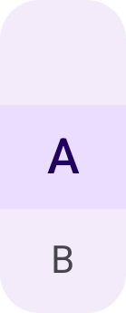

# Material Pickers 🎨

Material-aligned picker components for Jetpack Compose — expressive, customizable, and seamlessly fitting within the [Material 3](https://m3.material.io/) design system.\
The library provides ready-to-use vertical, horizontal, and double (paired) pickers, plus low-level primitives to build fully custom picker layouts.


[](https://jitpack.io/#eidam-slices/material-pickers)

---

## Installation ⚡

Add **JitPack** to your repositories and include the dependency:

```settings.gradle.kts
repositories {
    maven(url = "https://jitpack.io")
}
```

```build.gradle.kts
dependencies {
    implementation("com.github.eidam-slices:material-pickers:0.3.4")
}
```

---

## Ready-to-use Pickers 🖼️

### Vertical & Horizontal Picker

A basic, Material-style vertical or horizontal item picker.

**Parameters:**

- `modifier: Modifier` – Jetpack Compose modifier (width, height, padding, ...).
- `items: List<T>` – list of items to display (any type with proper `toString()`).
- `selectedIndex: Int` – index of currently selected item.
- `onItemSelected: (Int) -> Unit` – callback triggered when user clicks or scrolls to a new index.
- `style: SinglePickerStyle` – styling tokens (surface color, indicator color, surface shape, ...).
- `itemsVisible: Int` – number of items visible (must be odd).

<div style="display: flex; align-items: center; gap: 20px;">
  
  
</div>

### Double Vertical & Horizontal Picker

Two Single Pickers on one surface, smoothly connected.

**Parameters:**

- `modifier: Modifier` – Jetpack Compose modifier (width, height, padding, ...).
- `itemsTop / itemsLeft: List<T1>` – items for the top / left picker.
- `itemsBottom / itemsRight: List<T2>` – items for the bottom / right picker.
- `selectedIndexTop / selectedIndexLeft: Int` – selected index for top / left picker.
- `selectedIndexBottom / selectedIndexRight: Int` – selected index for bottom / right picker.
- `onItemSelectedTop / onItemSelectedLeft: (Int) -> Unit` – callback triggered when user clicks or scrolls to a new index on top / left
- `onItemSelectedBottom / onItemSelectedLeft: (Int) -> Unit` – callback triggered when user clicks or scrolls to a new index on bottom / right
- `style: DoublePickerStyle` – styling tokens (surface color, indicator color, surface shapes, text offset ...).
- `itemsVisible: Int` – number of items visible (must be odd).

<div style="display: flex; align-items: center; gap: 20px;">
  
  
</div>

---

## Styling 🎨

You can style pickers using PickerStyle implementations – `SinglePickerStyle` and `DoublePickerStyle`.

### PickerStyle

- `surfaceColor: Color` – color of surface.
- `indicatorColor: Color` – color of selected item indicator.
- `indicatorShape: Shape` – shape of selected item indicator.
- `selectedItemTextColor: Color` – color of selected item text.
- `unselectedItemTextColor: Color` – color of unselected item text.

**Overrides for variants:**

### SinglePickerStyle

- `surfaceShape: Shape` – shape of the surface.

### DoublePickerStyle

- `surfaceShapes: Pair<Shape, Shape>` – pair of shapes, first for left/top picker, second for right/bottom.
- `textOffset: Dp` – offset to visually bring pickers closer together.

---

## Build Your Own Picker 🛠️

You can build custom pickers using `GenericPicker`.

### Generic Picker

**Parameters:**
- `modifier: Modifier` – Jetpack Compose modifier (width, height, padding, ...).

- `items: List<T>` – list of items to display.

- `selectedIndex: Int` – index of currently selected item.

- `onItemSelected: (Int) -> Unit` – callback triggered on click or scroll.

- `orientation: Orientation` – vertical or horizontal orientation.

- `itemsVisible: Int` – number of visible items (must be odd).

- `background: @Composable () -> Unit` – background composable (usually Surface).

- `item: @Composable (PickerItemData) -> Unit` – defines item UI (label, selected, size, onClick).

- `selectionIndicator: @Composable(itemSize: DpSize) -> Unit` – indicator composable over selected item.

**Example:**

```kotlin
var selectedIndex by remember { mutableStateOf(0) }

GenericPicker(
    modifier = Modifier
        .width(128.dp)
        .height(40.dp),
    items = listOf("🇩🇪", "🇨🇿", "🇵🇱"),
    selectedIndex = selectedIndex,
    onItemSelected = { selectedIndex = it },
    orientation = Orientation.Horizontal,
    itemsVisible = 3,

    item = {
        Box(
            modifier = Modifier
                .height(it.size.height)
                .width(it.size.width)
                .clickable { it.onClick() },
            contentAlignment = Alignment.Center,
        ) {
            Text(it.label)
        }
    },
    selectionIndicator = {
        val baseColor = remember { Color(0xFF304FFE) }

        Surface(
            modifier = Modifier
                .height(it.height)
                .width(it.width)
                .padding(1.dp),
            shape = RoundedCornerShape(10.dp),
            color = baseColor.copy(alpha = 0.25f),
        ) {
            Box(
                modifier = Modifier.fillMaxSize(),
                contentAlignment = Alignment.BottomCenter
            ) {
                Image(
                    modifier = Modifier
                        .fillMaxWidth()
                        .height(8.dp),
                    imageVector = Icons.Sharp.ArrowDropUp,
                    colorFilter = ColorFilter.tint(baseColor.copy(alpha = 0.75f)),
                    contentDescription = null,
                    contentScale = ContentScale.None
                )
            }
        }
    },
    background = {
        Surface(shape = RoundedCornerShape(10.dp)) {}
    }
)
```

**Output example:**


